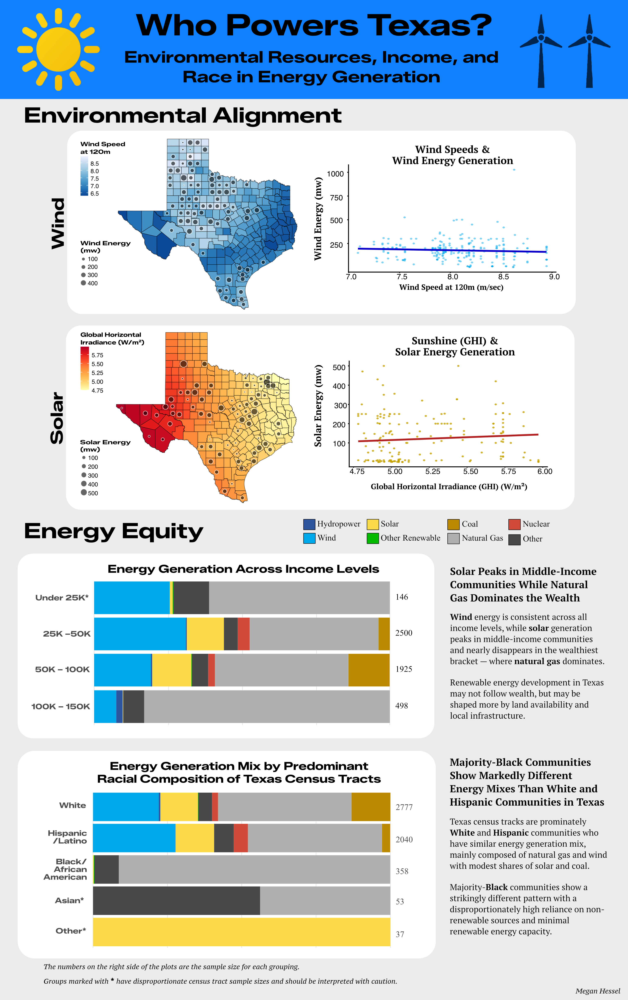

# Texas Energy Grid Database

*Author: Megan Hessel*

The purpose of this repository is to create a database and visualizations answering:

**Do Texas communities optimize their energy generation around local environmental resources, and do socioeconomic and demographic disparities influence how those resources are utilized?**

[{width="857"}](https://www.datacenterdynamics.com/en/news/equinix-buys-green-energy-in-oklahoma-and-texas/)

------------------------------------------------------------------------

**This repository**

1.  Gathers Texas socioeconomic, energy, and environmental data from the Web (details below)

2.  Cleans the raw data sets: `1_data_wrangling.qmd`

3.  Creates a database: `2_initalize_database.sql`

4.  Develops data visualizations to answer the question above: `3_environmental_factors_viz.qmd` and `4_socioEconomic_viz.qmd`

## Data

The data is not located within this repository. The data used in the Texas energy grid database is public, open-sourced on the web. Details and sources are provided below.

| Data | Description | Source |
|------|-------------|--------|
| Socioeconomic | ACS survey data on income and racial composition by census tract. Columns: avg income (b19013e1), White (b03002e3), Black/AA (b03002e4), AI/AN (b03002e5), NH/PI (b03002e8), Hispanic/Latino (b03002e12), two or more races (b03002e9). | [American Community Survey (ACS)](https://www.census.gov/programs-surveys/acs/) |
| Energy | EIA Form 860 generator-level data. Uses Plant and Generator sheets for energy source (`energy_source_1`), nameplate capacity (MW) (`nameplate_capacity_mw`), and plant coordinates. | [US Energy Information Administration (EIA)](https://www.eia.gov/electricity/data/eia860/) |
| Wind | Modeled annual average wind speed (onshore & offshore), contiguous US, 2007–2013. | [WIND Toolkit – NREL](https://www.nrel.gov/grid/wind-toolkit.html) |
| Solar (GHI) | Multi-year annual average global horizontal irradiance (kWh/m²/year) for the US. | [National Solar Radiation Database (NSRDB)](https://nsrdb.nrel.gov/data-sets/us-data) |
| Texas Counties | US county shapefiles filtered to Texas. | [2024 TIGER/Line Shapefiles – US Census Bureau](https://www.census.gov/cgi-bin/geo/shapefiles/index.php?year=2024&layergroup=Counties+%28and+equivalent%29) |

## Repo Structure

All qmds and sql scripts are located in the repository root and labeled in project order.

Cleaning and wrangling the raw data sets are accomplished in `1_data_wrangling.qmd` . Creating the database is done in the `2_initalize_database.sql` . Data visualization to answer the overarching question is within `3_environmental_factors_viz.qmd` and `4_socioEconomic_viz.qmd` . Data visualizations are saved in the `figs` folder, whereas the final infographic is in the `infographic` folder. Details about the R package requirements are located in the `requirements.txt`.

```{r}
├── 1_data_wrangling.qmd
├── 2_initalize_database.sql
├── 3_enviromental_factors_viz.qmd
├── 4_socioEconomic_viz.qmd
├── README.md
├── Texas_energy_grid_database.Rproj
├── database_queries.sql
├── requirements.txt
├── figs
│   ├── income_energy_plot.pdf
│   ├── race_energy_plot.pdf
│   ├── solar_texas_linePlot.pdf
│   ├── solar_texas_map.pdf
│   ├── wind100m_texas_lineplot.pdf
│   ├── wind100m_texas_map.pdf
│   ├── wind120m_texas_lineplot.pdf
│   └── wind120m_texas_map.pdf
└── infographic
    ├── tx_wind_picture.png
    └── infographic_v7.png
```

## Final Infographic 



## References

Brun, J., Janée, G., Adams, A., and Curty, R. (2026). *EDS 213: Databases and Data Management*. <https://ucsb-library-research-data-services.github.io/bren-eds213/#instructors>

Draxl, C., Hodge, B. M., Clifton, A., & McCaa, J. (2015). The Wind Integration National Dataset (WIND) Toolkit. *Applied Energy*, *151*, 355–366.

King, J., Clifton, A., & Hodge, B. M. (2014). *Validation of power output for the WIND Toolkit* (Technical Report No. NREL/TP-5D00-61714). National Renewable Energy Laboratory.

Lieberman-Cribbin, W., Draxl, C., & Clifton, A. (2014). *Guide to using the WIND Toolkit validation code* (Technical Report No. NREL/TP-5000-62595). National Renewable Energy Laboratory.

Sengupta, M., Xie, Y., Lopez, A., Habte, A., Maclaurin, G., & Shelby, J. (2018). The national solar radiation data base (NSRDB). *Renewable and Sustainable Energy Reviews*, *89*, 51–60.

U.S. Census Bureau. (2019). *American Community Survey 5-year Estimates*. <https://www.census.gov/programs-surveys/acs>

U.S. Census Bureau. (2025). *TIGER/Line® shapefiles*. <https://www.census.gov/cgi-bin/geo/shapefiles/index.php>

U.S. Energy Information Administration. (2025). *Form EIA-860 detailed data with previous form data (EIA-860A/860B)*. <https://www.eia.gov/electricity/data/eia860/>
